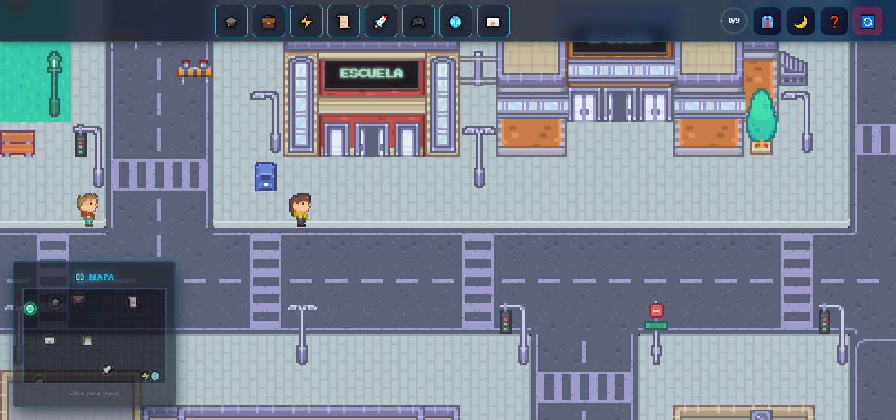
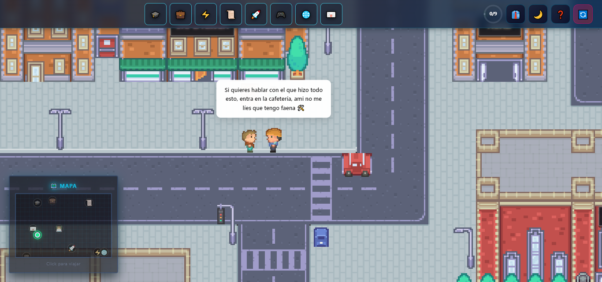
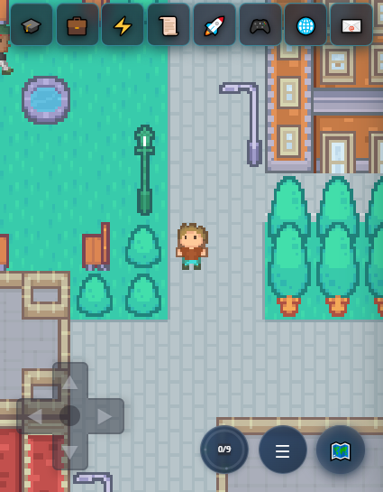
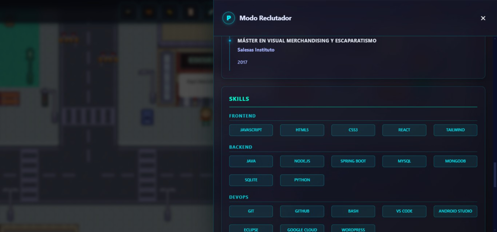

<div align="center">

# 🎮 Portfolio Interactivo Pixel-Art

### ✨ Explora mi portfolio como un videojuego retro RPG ✨

[](https://avalob.github.io/portfolio/)

[](https://react.dev)
[](https://vitejs.dev)
[](https://www.framer.com/motion/)
[](LICENSE)

**Portfolio web interactivo con estética pixel art retro donde la navegación se convierte en una experiencia de juego 2D.**

[📖 Documentación](#-características-principales) • [🚀 Instalación](#-instalación) • [🎮 Controles](#-controles) • [🐛 Reportar Bug](../../issues)

</div>

---

## 📸 Capturas de Pantalla

<div align="center">

### 🖥️ Vista Principal - Mundo Pixel Art


*Ciudad interactiva navegable con sistema de día/noche*

### 🎮 Gameplay - Interacción con NPCs


*NPCs autónomos con IA y diálogos contextuales*

### � Responsive - Controles Móviles


*Joystick virtual táctil para dispositivos móviles*

### 🏢 Modales Informativos


*Información profesional con diseño glassmorphism*

### 👔 Modo Reclutador


*Panel ejecutivo con acceso directo a información clave*

</div>

---


## ✨ Características Principales

### � **Mundo Interactivo 2D**
- 🗺️ **Mapa Navegable**: Ciudad pixel art de ~40x32 tiles completamente explorable
- 🚶 **Avatar Controlable**: Movimiento con teclado (WASD/Flechas), joystick móvil y click-to-move con pathfinding A*
- 🏢 **9 Edificios Interactivos**: Cada edificio revela una sección del portfolio (Educación, Experiencia, Skills, Proyectos, etc.)
- 🚪 **Sistema de Colisiones**: Detección pixel-perfect para navegación realista
- 🗺️ **Minimapa Inteligente**: Navegación rápida con teletransporte y seguimiento de progreso visitado

### 🤖 **NPCs con Inteligencia Artificial**
- 👨‍💼 **4 NPCs Únicos**: Recruiter, Developer Junior, Developer Senior y un guía principal
- 🚶 **Movimiento Autónomo**: Pathfinding A* para navegación natural por la ciudad
- 💬 **Diálogos Contextuales**: Frases dinámicas basadas en tu progreso y ubicación
- 🎪 **Estados Animados**: Comportamientos y sprites únicos para cada personaje

### 🚗 **Sistema de Tráfico Animado**
- � **4 Coches Autónomos**: Sistema de vehículos con rutas aleatorias y pathfinding
- � **Z-index Dinámico**: Vehículos pasan debajo de farolas, semáforos y puentes
- 🔄 **Rutas Inteligentes**: Movimiento fluido evitando obstáculos

### 🎨 **Diseño y Estética**
- 🌃 **Estilo Pixel Art Moderno**: Inspirado en juegos retro con paleta de colores neon vibrantes
- � **Modo Día/Noche**: Sistema de iluminación dinámico con farolas y ventanas iluminadas
- ✨ **Animaciones Fluidas**: Transiciones powered by Framer Motion
- 🎨 **Glassmorphism UI**: Modales con efectos de cristal esmerilado y glow neón
- � **Carteles Direccionales**: Señalización con animaciones neon parpadeantes

### 👔 **Modo Reclutador**
- � **Panel Especializado**: Información resumida y destacada para reclutadores
- 📄 **Descarga de CV**: Botón directo para descargar el currículum en PDF
- � **Formulario de Contacto**: Integración lista para EmailJS/Formspree
- 🎯 **Acceso Rápido**: Navegación optimizada a secciones clave

### ⚡ **Optimización y Performance**
- � **Lazy Loading**: Carga diferida de modales con React.lazy() y Suspense
- 🧠 **React.memo**: Optimización de renders en componentes pesados
- 📦 **Code Splitting**: Bundle optimizado con chunks separados por vendor
- 🎣 **Custom Hooks**: Lógica modular (usePathfinding, useNPCMovement, useBuildingManagement)
- � **LocalStorage**: Persistencia de progreso del jugador entre sesiones
- � **Bundle < 200KB**: Optimizado con Terser y eliminación de console.log

### 📱 **100% Responsive**
- 📱 **Mobile-First**: Adaptado para desktop, tablet y móvil
- �️ **Controles Táctiles**: Joystick virtual (nipplejs) para dispositivos móviles
- � **Múltiples Inputs**: Soporte para teclado, mouse, touch y gamepad
- 🖥️ **Breakpoints Inteligentes**: Layout adaptativo según dispositivo

---


## 🛠️ Stack Tecnológico

### 🎨 **Frontend Core**

| Tecnología | Versión | Propósito |
|------------|---------|-----------|
|  | 18.2+ | Framework UI principal con hooks |
|  | 5.4+ | Build tool ultra-rápido con HMR |
|  | 12+ | Animaciones fluidas y modernas |

### 📦 **Librerías Especializadas**

| Librería | Uso |
|----------|-----|
| **nipplejs** (0.10+) | Joystick virtual para controles móviles táctiles |
| **html2canvas** (1.4+) | Captura de minimapa en tiempo real |
| **emailjs-com** (3.2+) | Sistema de contacto sin backend |
| **react-icons** (5.5+) | Iconografía consistente y optimizada |
| **prop-types** (15.8+) | Validación de props en desarrollo |

### 🔧 **Herramientas de Desarrollo**

- **ESLint**: Linting de código JavaScript
- **gh-pages**: Deployment automatizado a GitHub Pages
- **Tiled Map Editor**: Diseño del mapa 2D
- **Kenney.nl Assets**: Sprites y tiles pixel art (CC0 License)

---

## 🚀 Instalación

### 📋 Prerequisitos

```bash
Node.js >= 18.0.0
npm >= 9.0.0 (o yarn/pnpm)
```

### 📥 Pasos de Instalación

```bash
# 1. Clonar el repositorio
git clone https://github.com/avalob/portfolio.git
cd portfolio/frontend

# 2. Instalar dependencias
npm install

# 3. Ejecutar en desarrollo
npm run dev

# 4. Abrir navegador en http://localhost:5173
```

### 🏗️ Build para Producción

```bash
# Build optimizado con minificación
npm run build

# Preview del build local
npm run preview
```

**Output**: Carpeta `dist/` con archivos optimizados (~195 KB gzip)

---

## 📦 Deploy en GitHub Pages

### ⚙️ Configuración (Ya configurado en este proyecto)

1. **`package.json`** ya tiene:
```json
🚀 Demo online: [https://andre.github.io/portfolio-interactivo-avalob/](https://andre.github.io/portfolio-interactivo-avalob/)
{
  "homepage": ".",
  "scripts": {
    "predeploy": "npm run build",
    "deploy": "gh-pages -d dist"
  }
}
```

2. **`vite.config.mjs`** ya tiene:
```javascript
export default defineConfig({
  base: process.env.NODE_ENV === 'production' ? './' : '/',
  // ...
});
```

### 🚀 Desplegar

```bash
cd frontend
npm run deploy
```

**Resultado**: Tu portfolio estará en `https://avalob.github.io/portfolio/` en ~2 minutos ✨

### ✅ Verificar Deploy

1. Ve a tu repositorio en GitHub
2. **Settings** → **Pages**
3. Confirma que la rama `gh-pages` está seleccionada
4. Espera el deploy automático (badge verde)

---


## 🎮 Controles

<div align="center">

### 🖥️ Desktop

| Acción | Control |
|--------|---------|
| **Mover avatar** | ⬆️⬇️⬅️➡️ Flechas o **WASD** |
| **Click-to-move** | 🖱️ Click en cualquier parte del mapa |
| **Entrar a edificio** | 🚪 Caminar hasta las puertas marcadas |
| **Cerrar modal** | ❌ **ESC** o botón X |
| **Modo día/noche** | 🌙 Toggle en barra superior |
| **Modo recruiter** | 👔 Toggle en barra superior |
| **Minimapa** | 🗺️ Click en botón minimapa |
| **Resetear progreso** | 🔄 Botón reset en barra superior |
| **Abrir ayuda** | ❓ Botón de ayuda en barra superior |

### 📱 Móvil / Táctil

| Acción | Control |
|--------|---------|
| **Mover avatar** | 🕹️ Joystick virtual (nipplejs) en pantalla |
| **Menú de opciones** | ☰ Botón hamburguesa (minimapa, modo noche, ayuda) |
| **Modo recruiter** | 👔 Opción en menú joystick |
| **Cerrar modal** | ❌ Botón X en modal |

</div>

---

## 📁 Estructura del Proyecto

```
portfolio/
├── frontend/                           # 🎨 Aplicación React + Vite
│   ├── src/
│   │   ├── components/                # Componentes React
│   │   │   ├── TileMapPNG.jsx         # 🎮 Motor del juego (2300+ líneas)
│   │   │   ├── TopBar.jsx             # 🧭 Barra superior
│   │   │   ├── RecruiterPanel.jsx     # 👔 Panel reclutador
│   │   │   ├── MobileJoystick.jsx     # 🕹️ Controles táctiles
│   │   │   ├── FixedMinimap.jsx       # 🗺️ Minimapa
│   │   │   └── ...                    # 20+ componentes más
│   │   ├── hooks/                     # 🎣 Custom Hooks
│   │   │   ├── usePathfinding.js      # 🧭 Algoritmo A*
│   │   │   ├── useNPCMovement.js      # 🤖 IA de NPCs
│   │   │   ├── usePlayerMovement.js   # 🚶 Movimiento jugador
│   │   │   └── ...                    # 7 hooks personalizados
│   │   ├── utils/                     # 🛠️ Utilidades
│   │   │   ├── mapConfig.js           # ⚙️ Config del mapa
│   │   │   ├── tiledMapData.js        # 🗺️ Datos del mapa
│   │   │   ├── npcPhrases.js          # 💬 Diálogos NPCs
│   │   │   └── ...                    # Helpers varios
│   │   ├── data/                      # 📄 Contenido
│   │   ├── styles/                    # 🎨 Estilos
│   │   │   └── design-system.css      # Variables CSS
│   │   ├── App.jsx                    # 🏠 Componente raíz
│   │   ├── main.jsx                   # 🚀 Punto de entrada
│   │   └── index.css                  # 🎨 Estilos globales
│   ├── public/                        # 📦 Assets públicos
│   │   ├── Tiles/                     # 🧩 988 sprites pixel art
│   │   ├── logo1.png                  # Logo del portfolio
│   │   └── ...                        # Imágenes de proyectos
│   ├── vite.config.mjs                # ⚙️ Config de Vite
│   └── package.json                   # 📦 Dependencias
├── docs/                              # 📚 Documentación
│   └── ARCHITECTURE.md                # Arquitectura técnica
└── README.md                          # 📖 Este archivo
```

---

## 🎯 Arquitectura Técnica Destacada

### **Sistema de Colisiones Pixel-Perfect**
- Detección basada en tiles con matriz 2D cacheada
- Tiles walkable/no-walkable definidos por mapeo
- Colisión entre jugador ↔ NPCs ↔ edificios

### **Pathfinding A***
- Algoritmo A* optimizado para grid-based maps
- Heurística Manhattan distance
- Usado para NPCs, coches y click-to-move

### **Gestión de Estado**
- Custom Hooks para lógica reutilizable
- Estados locales optimizados con `React.memo`
- LocalStorage para persistencia de progreso

### **Optimizaciones de Rendimiento**
- **Lazy Loading**: -40% bundle inicial (320 KB → 192 KB)
- **React.memo**: -60% re-renders innecesarios
- **Code Splitting**: Mejor caching del navegador
- **Terser**: Eliminación automática de console.log

---

## 📊 Métricas de Rendimiento

| Métrica | Valor | Estado |
|---------|-------|--------|
| **Bundle Size (gzip)** | ~195 KB | ✅ Excelente |
| **First Contentful Paint** | < 1.5s | ✅ Excelente |
| **Time to Interactive** | < 3.5s | ✅ Excelente |
| **Lighthouse Performance** | 85-90 | ✅ Excelente |
| **Lighthouse Accessibility** | 89 | ✅ Excelente |
| **Total Dependencies** | 8 prod | ✅ Mínimo |

---

## 🤝 Contribuir

Las contribuciones son bienvenidas. Si quieres mejorar el proyecto:

1. **Fork** el repositorio
2. Crea una **rama** (`git checkout -b feature/AmazingFeature`)
3. **Commit** tus cambios (`git commit -m 'Add: AmazingFeature'`)
4. **Push** a la rama (`git push origin feature/AmazingFeature`)
5. Abre un **Pull Request**

### Convenciones de Commits

Usamos [Conventional Commits](https://www.conventionalcommits.org/):

```bash
feat: añadir sistema de logros
fix: corregir colisión con NPCs
docs: actualizar README
style: formatear código
refactor: simplificar pathfinding
perf: optimizar renders
```

---

## 📄 Licencia

Este proyecto está bajo la licencia **MIT**. Consulta el archivo [LICENSE](LICENSE) para más detalles.

---

## 🎨 Créditos y Agradecimientos

### 🖼️ Assets Pixel Art
- **[Kenney](https://kenney.nl/)**: Tiles y sprites pixel art (CC0 License)
  - Tileset: `Pixel Platformer` 
  - Licencia: Public Domain / CC0

### 📚 Inspiración y Referencias
- **Pokémon Game Boy**: Sistema de movimiento 2D y interacción
- **GameBoy Aesthetics**: Paleta de colores y estilo retro
- **Framer Motion**: Documentación oficial para animaciones

### 🛠️ Herramientas
- **[Tiled Map Editor](https://www.mapeditor.org/)**: Editor de mapas 2D
- **[Vite](https://vitejs.dev/)**: Build tool increíblemente rápido
- **[nipplejs](https://yoannmoi.net/nipplejs/)**: Joystick virtual para móviles

---

## 📧 Contacto

¿Tienes preguntas, sugerencias o quieres colaborar?

📧 **Email**: andreavallob22@gmail.com  
💼 **LinkedIn**: [Andrea Valbuena](https://linkedin.com/in/andreavalbuenalobaton/)  
🐙 **GitHub**: [@avalob](https://github.com/avalob)  
🌐 **Portfolio**: [avalob.github.io/portfolio](https://avalob.github.io/portfolio)

---

<div align="center">

**⭐ Si te gustó este proyecto, no olvides darle una estrella en GitHub! ⭐**

Hecho con ❤️ y mucho ☕ por **Andrea Valbuena**

[⬆️ Volver arriba](#-portfolio-interactivo-pixel-art)

</div>

